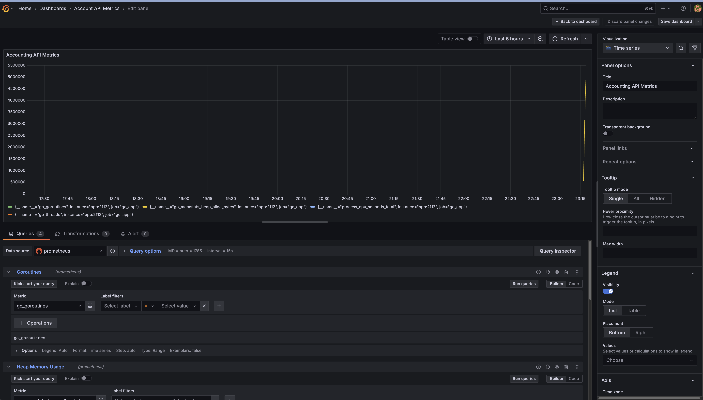

# Accounting API with GO 

## Overview 📖

The Accounting API is a backend service built with Go, designed for managing user authentication, retrieving account balances, and facilitating transactions between users. It uses JSON format for requests and responses and employs JWT-based authentication for secure access. The API is modular and scalable, making it ideal for high-traffic applications.

## Features 💎

	•	User Management: Register and authenticate users with secure password hashing.
	•	Transaction Management: Handle balance transfers and retrieve account details.
	•	Authentication: JSON Web Tokens (JWT) for secure, stateless user sessions.
	•	Application Metrics: Live Go metrics with Prometheus and Grafana

## Installation 🏗️

1. Clone the repository:

   ```bash
    git clone https://github.com/coderemre/accounting-api-with-go.git
    cd accounting-api-with-go
   ```

2. Create .env file:
    DB_HOST=127.0.0.1
    PORT=8080
    LOG_LEVEL=debug
    DATABASE_DSN={{username}}:{{password}}@tcp(localhost:3306)/{{DB_NAME}}


3. Run project:
   ```bash
    go run main.go
   ```


## Monitoring Setup 📊

This project includes full monitoring support via Prometheus and Grafana.

### Prometheus

Prometheus is configured to scrape metrics from the Go application via the `/metrics` endpoint exposed on port `2112`. These include:

- Goroutine count
- Heap memory usage
- CPU time
- Thread count

Prometheus settings can be found in `monitoring/prometheus.yml`.

### Grafana

Grafana is pre-configured to visualize Prometheus metrics.

📸 **Sample Dashboard Screenshot**  


To access Grafana:

- URL: `http://localhost:3000`
- Default credentials: `admin / admin`

You can import the dashboard manually using the visual editor or upload a JSON panel definition.

---

## What’s Inside 🚀
### Endpoints:
	•	User Authentication: Register and login endpoints with JWT integration.
	•	Transaction Management: Manage user balances and transfer funds.


### Database:
	•	Tables:
	•	users: Stores user information and hashed passwords.
	•	transactions: Tracks balance transfers and timestamps.
	•	balances: Maintains the current balance of each user.
	•	Environment Configuration:
	•	Fully configurable with .env for flexible setups.